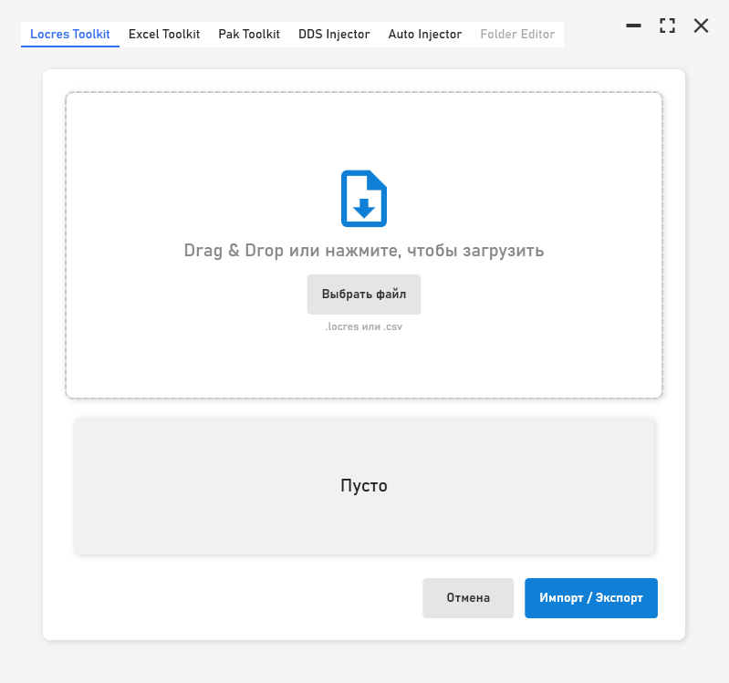
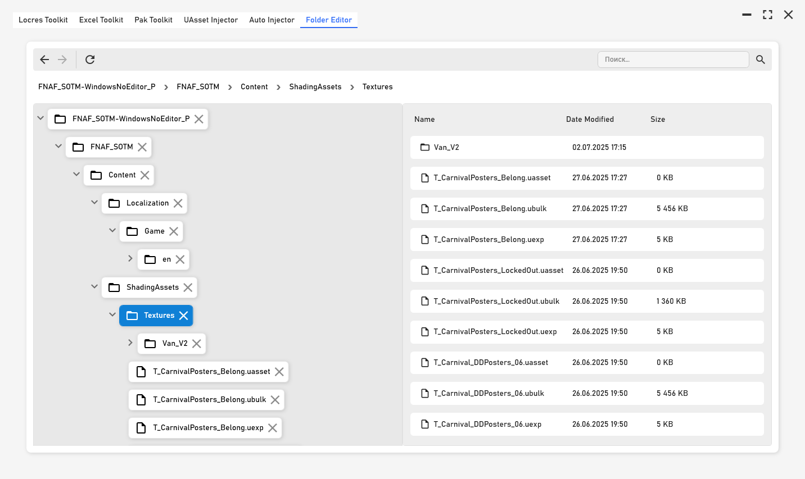

# TinyPackerExtended

<p align="center">
  
</p>

---

## 📖 Описание / Description

**RU:** TinyPackerExtended — универсальный инструмент для обратной упаковки ассетов из игровых пакетов Unreal Engine. Вместо распаковки он позволяет собрать и упаковать ресурсы обратно.

**EN:** TinyPackerExtended is a universal tool for reverse packaging of assets from Unreal Engine game packages. Instead of unpacking, it allows you to assemble and pack resources back.

---

## 🚀 Возможности / Features

- **Locres Toolkit** — работа с локализованными ресурсами (.locres, .csv) / working with localized resources (.locres, .csv).
- **Excel Toolkit** — импорт/экспорт таблиц (.csv, .xlsx) / import/export tables (.csv, .xlsx).
- **Pak Toolkit** — упаковка папок в `.pak` / packaging folders into `.pak`.
- **UAsset Injector** — встраивание текстур в `.uasset` файлы / embedding textures into `.uasset` files.
- **Auto Injector** — автоматическая группировка и инжект `.uasset` + `.png` / automatic grouping and injection of `.uasset` + `.png`.
- **Folder Editor** — интерактивный проводник для просмотра и управления файлами проекта / interactive file explorer for browsing and managing project files.

---

## ⚙️ Установка / Installation

**RU:**
1. Клонируйте репозиторий:
   ```bash
   git clone https://github.com/LKAYHot/TinyUnrealPackerExtended.git
   ```
2. Откройте решение в Visual Studio 2022 (или выше).
3. Соберите проект в конфигурации `Release`.
4. Запустите `TinyPackerExtended.exe`.

**EN:**
1. Clone the repository:
   ```bash
   git clone https://github.com/LKAYHot/TinyUnrealPackerExtended.git
   ```
2. Open the solution in Visual Studio 2022 (or later).
3. Build the project in the `Release` configuration.
4. Run `TinyPackerExtended.exe`.

---

## 💡 Использование / Usage

**RU:**
1. Выберите нужный модуль на верхней панели.
2. Загрузите файлы или папки через Drag & Drop или нажмите кнопку `Выбрать`.
3. Настройте параметры (например, компрессию в Pak Toolkit).
4. Нажмите кнопку `Запуск` или `Импорт/Экспорт` для выполнения операции.

**EN:**
1. Select the desired module from the top toolbar.
2. Upload files or folders via Drag & Drop or click the `Select` button.
3. Configure options (e.g., compression in the Pak Toolkit).
4. Click `Run` or `Import/Export` to execute the operation.

---

## 📸 Скриншоты / Screenshots

<p align="center">
  
  
</p>

---

## 🔧 Настройка / Customization

**RU:**
- В прогрессе

**EN:**
- In progress
---

## 📜 Лицензия / License

**RU:** Этот проект распространяется под лицензией MIT. Подробнее читайте в [LICENSE](LICENSE).

**EN:** This project is licensed under the MIT License. See [LICENSE](LICENSE) for details.

---